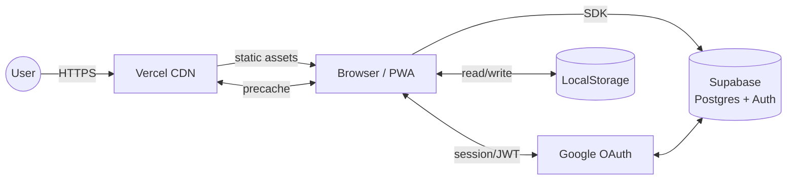
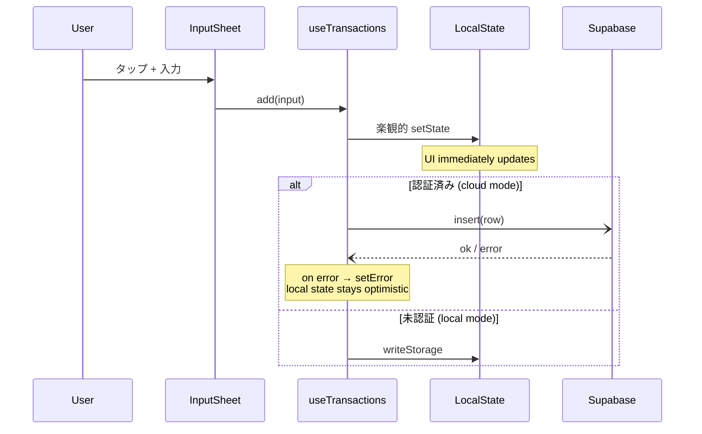
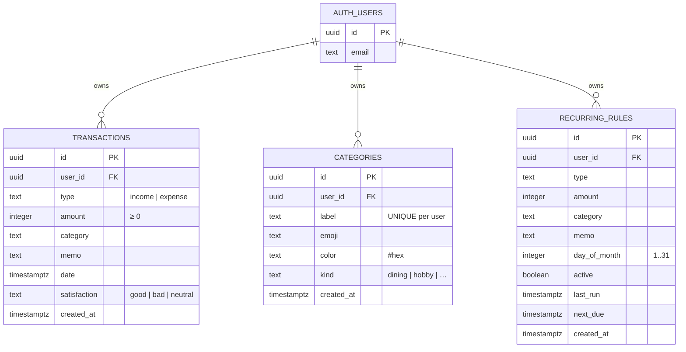

# worthit — Architecture

A walkthrough of how the app is structured, why each piece exists, and where the interesting trade-offs sit. Aimed at someone (a reviewer, a future-self, or a colleague) who has 10 minutes and wants to understand the system before reading any code.

---

## 1. System context



- **Browser is the app.** The server only serves static files; all logic runs client-side.
- **Supabase is optional.** If env vars are missing, the app silently falls back to LocalStorage. This keeps the project forkable without forcing a backend setup.
- **Google OAuth flows through Supabase Auth.** Tokens never touch our code directly.

---

## 2. App-internal layers

```
┌────────────────────────────────────────────────────┐
│ Presentation         components/*.tsx              │
│                      (StatementScreen, …)          │
├────────────────────────────────────────────────────┤
│ Context              context/*.tsx                 │
│                      Settings · Auth · Categories  │
├────────────────────────────────────────────────────┤
│ Domain hooks         hooks/*.ts                    │
│                      useTransactions               │
│                      useBudget                     │
│                      useRecurring                  │
│                      useUpdateChecker              │
├────────────────────────────────────────────────────┤
│ Pure utilities       utils/*.ts                    │
│                      scoring · advice · period     │
│                      csv · format · categories     │
├────────────────────────────────────────────────────┤
│ Infrastructure       lib/supabase.ts               │
└────────────────────────────────────────────────────┘
```

Each layer only depends on the one(s) below it. The pure-utility layer has zero React deps (or any browser deps where it matters) so it's trivially testable in Vitest. **All 43 unit tests live there.**

---

## 3. Data flow: adding a transaction



Key property: **the UI never waits for the network.** The cloud insert is fire-and-forget; errors surface in a non-blocking way. For a personal-scale app this is the right call.

---

## 4. Supabase schema



### Row Level Security

Every table has 4 RLS policies — `select`, `insert`, `update`, `delete` — all asserting `auth.uid() = user_id`. There is **no service-role key in the client**. A malicious user with the anon key still can't read another user's row.

> ☝ The schema lives entirely in [`supabase/schema.sql`](../supabase/schema.sql) and is idempotent — re-running it is safe.

---

## 5. State management

I use **plain React Context** for three slices, not Redux/Zustand/etc.:

| Context | Owns |
|---|---|
| `SettingsContext` | theme, font scale, locale |
| `AuthContext` | Supabase session, mode (`unauthenticated` / `authenticated` / `local-only` / `cloud-disabled`) |
| `CategoriesContext` | user-customized categories, merged getMeta |

Transactions / budget / recurring are **hook-scoped state inside `<Shell>`**. They're not in a context because no other tree needs them — exposing them globally would just add boilerplate.

### Why no Redux

The project has fewer than ~10 mutating actions across the whole app. The overhead of slices / selectors / typed action creators would exceed the cognitive load of the actual logic. React 19 + Context already gives me what I need.

---

## 6. Personality scoring

Five archetypes (`entertainer`, `strategist`, `creator`, `romantic`, `sage`) are picked from **five spending axes** plus a **sixth satisfaction axis**:

```
social      = 0.6·dining + 0.4·social_kind          → entertainer
strategic   = 0.55·self_investment + 0.3·daily +    → strategist
              0.15·utility
passionate  = 0.85·hobby + 0.15·self_investment     → creator
impulsive   = 0.8·impulse + 0.1·hobby + 0.1·other   → romantic
balanced    = entropy(kindRatios) / ln(N_kinds)     → sage (>0.9 + low peak)
fulfilled   = good / (good + bad)                   → reported, not for classification
```

The `sage` type only wins when **balanced > 0.9 AND no other axis ≥ 0.45** — both conditions matter. Tested explicitly in [`scoring.test.ts`](../src/utils/scoring.test.ts).

### Why kind, not category

User-created categories shouldn't break the personality system. So scoring is done on the **`kind` enum** (`dining | hobby | …`), and default categories map to kinds. Custom categories default to `kind=other`, which is excluded from all five axes but counted in `balanced`. The user can override `kind` in the category editor, which is then injected through the `customs` map to `diagnose()` to keep the function pure.

---

## 7. Performance

| Asset | Gzipped | Note |
|---|---|---|
| Initial JS bundle | ~92 KB | Lazy-loads AdviceScreen / ResultScreen / SettingsScreen |
| AdviceScreen chunk | ~108 KB | Pulls in Recharts only when the tab is opened |
| CSS | ~7 KB | Tailwind purged |

The PWA precaches ~20 entries (~1 MB) so subsequent visits load from disk. Supabase requests go through `NetworkOnly` — never stale data.

---

## 8. Deployment

- **`git push origin main` → Vercel** auto-deploys in ~90 seconds.
- The frontend reads `VITE_SUPABASE_URL` and `VITE_SUPABASE_ANON_KEY` from Vercel project env. **No secrets in the repo.**
- On every successful deploy, the new `index.html` references a new JS bundle filename (hashed). The `useUpdateChecker` hook in any open tab notices this within 5 minutes and pops the update banner.

---

## 9. What I deliberately didn't build

To keep the project shippable:

- **No offline write queue.** When offline and signed-in, optimistic UI updates work but the cloud mutation may fail silently. The next online launch reads from cloud. *Trade-off accepted: simplicity over robustness, since the local LocalStorage path covers the offline-only use case.*
- **No push notifications.** Web Push requires VAPID keys, a server endpoint, and Supabase Edge Functions for scheduling. The infra burden exceeded the marginal value for a personal-scale app.
- **No conflict resolution.** Last-write-wins. If two devices edit the same transaction within the same network round trip, one update silently loses. *Acceptable risk at this scale.*
- **No tests for React components.** Vitest tests only cover pure functions (scoring, advice, period, CSV, recurring math). Component behavior is verified manually.
- **No analytics.** Privacy by default; never wanted to ship a tracker on a finance app.

These trade-offs are spelled out further in [`DECISIONS.md`](./DECISIONS.md).
